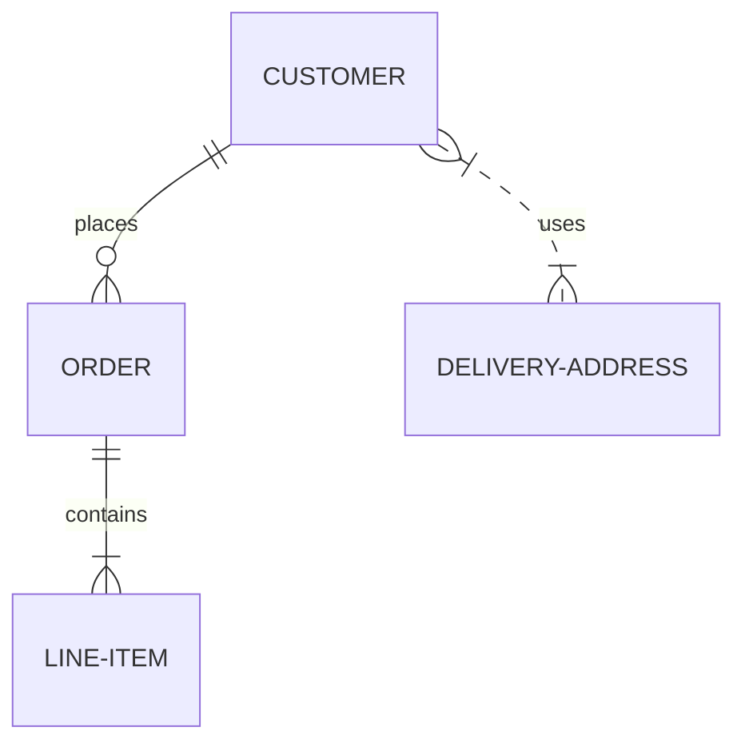
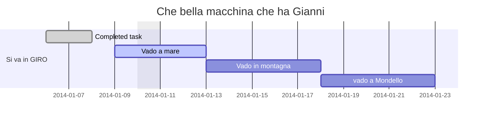
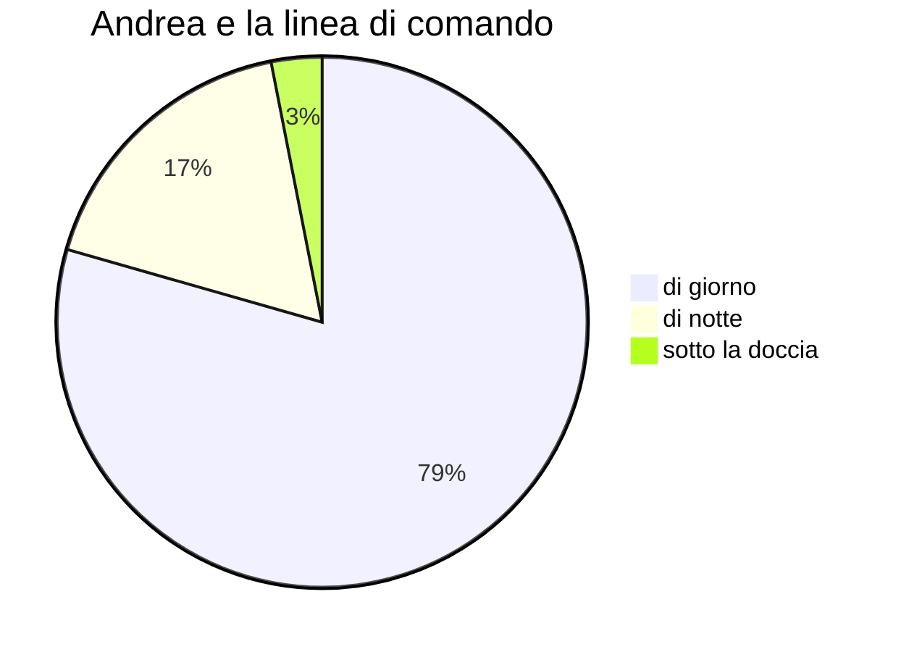

## Esempi mermaid

```mermaid
graph TB;
    A-->B;
    A-->C;
    B-->D;
    C-->D;
```

```mermaid
erDiagram
    CUSTOMER ||--o{ ORDER : places
    ORDER ||--|{ LINE-ITEM : contains
    CUSTOMER }|..|{ DELIVERY-ADDRESS : uses
```

```mermaid
gantt
dateFormat  YYYY-MM-DD
title Che bella macchina che ha Gianni
excludes weekdays 2014-01-10

section Si va in GIRO
Completed task            :done,    des1, 2014-01-06,2014-01-08
Vado a mare               :active,  des2, 2014-01-09, 3d
Vado in montagna               :         des3, after des2, 5d
vado a Mondello               :         des4, after des3, 5d
```

```mermaid
pie title Andrea e la linea di comando
    "di giorno" : 386
    "di notte" : 85
    "sotto la doccia" : 15
```