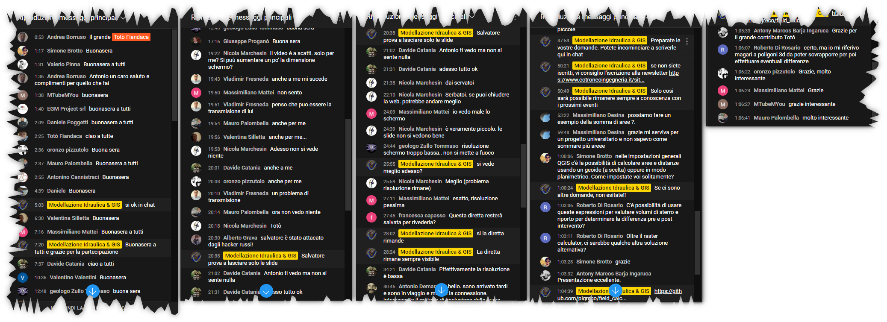

# Field Calc applicato all'idraulica

[QGIS](https://www.qgis.org/it/site/) è il più usato software GIS Desktop Free e Open Source, il suo Field Calc ha oltre 300 funzioni, di queste oltre 1/3 sono funzioni geometriche utilizzabili anche in ambito Idraulico per il calcolo di lunghezze, aree, buffer e tanto altro. In questo webinar vedremo come applicarlo al mondo dell'**Idraulica**. 


<!-- TOC -->

- [Field Calc applicato all'idraulica](#field-calc-applicato-allidraulica)
  - [Esempi proposti](#esempi-proposti)
  - [Relatore](#relatore)
  - [Webinar su Modellazione Idraulica & GIS](#webinar-su-modellazione-idraulica--gis)
  - [Slide](#slide)
  - [Programma](#programma)
  - [Risultati Webinar](#risultati-webinar)
  - [Marcatori di capitolo video YouTube](#marcatori-di-capitolo-video-youtube)
- [Riferimenti utili](#riferimenti-utili)

<!-- /TOC -->

## Esempi proposti

1. [Calcolo pendenza media dell'asta principale di un fiume](capitoli/calcolo_pendenza_media_idraulica_asta.md);
2. [Calcolo percentuale uso del suolo](capitoli/calcolo_percentuale_uso_del_suolo.md);
3. [Etichettare curve di livello per valori definiti](capitoli/etichettare_isoipse.md);
4. [Isoipse, caratteristiche e generalizzazione](capitoli/isoipse_caratteristiche_generalizzazione.md);
5. [Statistiche rapide](capitoli/statistiche_di_sintesi.md)
6. [Diagrammi](capitoli/diagrammi.md)

## Relatore

- **Totò FIANDACA** (aka pigreco) <br>(Membro [OpenDataSicilia](http://opendatasicilia.it/) (2022) 3 31mbro [QGIS Italia](http://qgis.it/) (2015) | Socio [GFOSS.it](https://gfoss.it/) (2017) | Membro [QGIS organization](https://github.com/qgis) (2020) | Ideatore della Guida [#HfcQGIS](http://hfcqgis.opendatasicilia.it/it/latest/) (2018))

<p align="center"><a href="" target="_blank"></a></p>

## Webinar su Modellazione Idraulica & GIS

- 📅 data: 31 marzo 2022
- 🕞 ore: 18:30 - 19:30+
- 📽 piattaforma YouTube, canale [Modellazione Idraulica & GIS](https://www.youtube.com/channel/UCgJf2dwyWAFbXeIJBV09QIg)
- 🔗 link diretta : <https://youtu.be/bXvsdFPhWuc>

## Slide

- [presentazione](https://docs.google.com/presentation/d/e/2PACX-1vRST7swyrM5ZeSuZUGw-nQIVBqxkRs07mJm_f1-DSt3SgVjOryHLxcKXizRwKaZLLX_Mo7ZK2VwtyRk/pub?start=false&loop=false&delayms=3000)

↑ [Torna su](#field-calc-applicato-allidraulica) ↑

## Programma

1. Introduzione a **QGIS**;
2. Introduzione a **Field Calc di QGIS**;
3. Esempi di uso per casi di Idraulica;
4. Domande/risposte finali.


## Risultati Webinar

- numero massimo partecipanti: **65**
- domande poste: molte!




## Marcatori di capitolo video YouTube

1. [00:00:00 | INIZIO](https://youtu.be/bXvsdFPhWuc)
2. [00:01:08 | INTRODUZIONE ANTONIO COTRONEO](https://youtu.be/bXvsdFPhWuc?t=68)
3. [00:04:06 | INTRODUZIONE TOTò FIANDACA](https://youtu.be/bXvsdFPhWuc?t=246)
4. [00:06:03 | SLIDE: MI PRESENTO](https://youtu.be/bXvsdFPhWuc?t=363)
5. [00:08:22 | SLIDE: QGIS COSA È...](https://youtu.be/bXvsdFPhWuc?t=502)
6. [00:10:45 | LE ESPRESSIONI DI QGIS](https://youtu.be/bXvsdFPhWuc?t=645)
7. [00:12:05 | LE ESPRESSIONI: DOVE UTILIZZARLE](https://youtu.be/bXvsdFPhWuc?t=725)
8. [00:15:40 | LE ESPRESSIONI: ESEMPI](https://youtu.be/bXvsdFPhWuc?t=940)
9. [00:21:34 | ESEMPI IN QGIS](https://youtu.be/bXvsdFPhWuc?t=1294)
10. [00:21:45 | PRIMO ESEMPIO: PLUGIN PENDENZA MEDIA](https://youtu.be/bXvsdFPhWuc?t=1305)
11. [00:27:43 | SELEZIONE ELEMENTI GEOMETRICI](https://youtu.be/bXvsdFPhWuc?t=1663)
12. [00:32:32 | CALCOLO % USO SUOLO](https://youtu.be/bXvsdFPhWuc?t=1952)
13. [00:42:06 | ETICHETTATURA CURVE DI LIVELLO](https://youtu.be/bXvsdFPhWuc?t=2526)
14. [00:53:20 | GENERALIZZAZIONE CURVE LIVELLO](https://youtu.be/bXvsdFPhWuc?t=3200)
15. [00:55:48 | DOMANDE FINALI](https://youtu.be/bXvsdFPhWuc?t=3348)

```mermaid
gantt
dateFormat HH:MM:SS
title Field Calc di QGIS, Cosa è e come usarlo
Start : milestone, m1, 00:00:00, 0min
axisFormat  %H-%M

section Introduzione
Completed task             :done, m1, 2022:03:31:00:00:00
Antonio Cotroneo INTRO     :des1, after m1, 5m
Totò Fiandaca INTRO        :des2, after des1, 10m
section Slide
Totò Fiandaca in QGIS      :des3, after des2, 40m
Domande Finali             :des4, after des3, 10m
```

# Riferimenti utili

- **risorse**: <https://github.com/pigreco/field_calc_idraulica/raw/main/risorse/materiale_webinar-20220324.zip>
- **QGIS**: <https://www.qgis.org/it/site/>

↑ [Torna su](#field-calc-applicato-allidraulica) ↑
