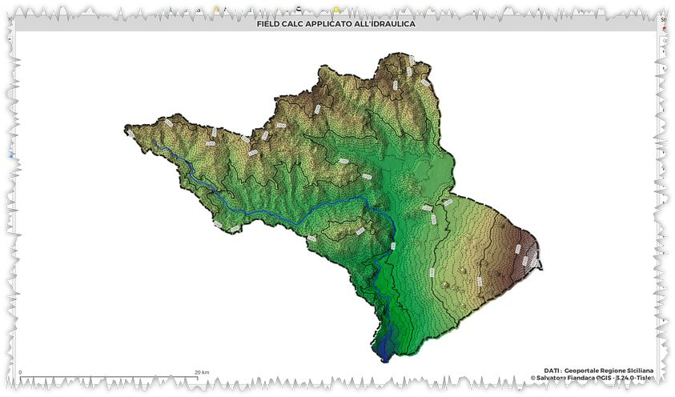
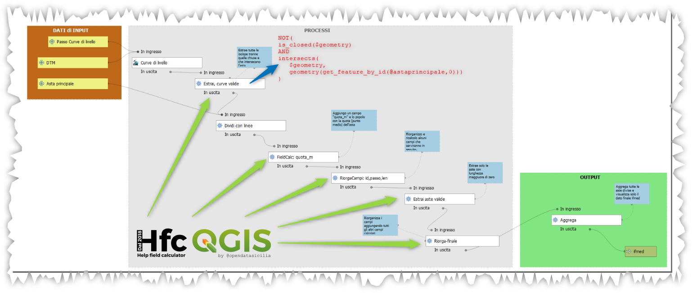

# Calcolo pendenza media

Come calcolare la pendenza media `idraulica` e `geometrica` di un'asta fluviale principale di un bacino. 

Formule e metodo di **Antonio Cotroneo**



<!-- TOC -->

- [Calcolo pendenza media](#calcolo-pendenza-media)
  - [Dati](#dati)
  - [Espressioni utilizzate](#espressioni-utilizzate)
    - [Selezionare curve di livello valide](#selezionare-curve-di-livello-valide)
    - [quota punto medio aste](#quota-punto-medio-aste)
    - [calcolo ID delle aste](#calcolo-id-delle-aste)
    - [calcolo lunghezze aste](#calcolo-lunghezze-aste)
    - [calcolo lunghezza cumulativa](#calcolo-lunghezza-cumulativa)
    - [calcolo lunghezza de-cumulativa](#calcolo-lunghezza-de-cumulativa)
    - [calcolo pendenza geometrica](#calcolo-pendenza-geometrica)
    - [calcolo pendenza geometria x1000](#calcolo-pendenza-geometria-x1000)
    - [fattore1](#fattore1)
    - [fattore2](#fattore2)
    - [pendenza media idraulica](#pendenza-media-idraulica)
    - [pendenza media geometrica](#pendenza-media-geometrica)
  - [Modello grafico](#modello-grafico)

<!-- /TOC -->

## Dati

1. DTM bacino;
2. asta fluviale principale

## Espressioni utilizzate

### Selezionare curve di livello valide

Per evitare che i calcoli siano contaminati di piccole curve di livello

```
is_closed( $geometry)
AND
intersects($geometry, geometry(get_feature_by_id( @astaprincipale,0)))
```

↑[torna su](#calcolo-pendenza-media)↑

### quota punto medio aste

Per ordinare la tabella attributi delle aste spezzate con le isoipse, calcolo `quota_m` del punto medio di ogni asta spezzata con le curve:

```
raster_value( @dtm ,1,line_interpolate_point($geometry, length($geometry)/2))
```

↑[torna su](#calcolo-pendenza-media)↑

### calcolo ID delle aste

```
array_find(array_reverse(array_agg("quota_m", order_by:="quota_m")),"quota_m")+1
```

↑[torna su](#calcolo-pendenza-media)↑

### calcolo lunghezze aste

calcolo delle lunghezze delle aste spezzate con le isoipse

```
round(length($geometry),2)
```

↑[torna su](#calcolo-pendenza-media)↑

### calcolo lunghezza cumulativa

```
with_variable('cucu',array_reverse(array_agg(len,order_by:="quota_m")),
    if(id=1,
        @cucu[0],
        round(array_sum(array_slice(@cucu,0,id-1)),2))
        )
```

↑[torna su](#calcolo-pendenza-media)↑

### calcolo lunghezza de-cumulativa

```
with_variable('cucu',array_reverse(array_agg(len,order_by:="quota_m")),
    if(id=1,
        array_sum(@cucu)-@cucu[0],
        round(array_sum(@cucu)- array_sum(array_slice(@cucu,0,id-1)),2))
        )
```

↑[torna su](#calcolo-pendenza-media)↑

### calcolo pendenza geometrica

```
round(@passocurvedilivello/length($geometry),5)
```

↑[torna su](#calcolo-pendenza-media)↑

### calcolo pendenza geometria x1000

```
round(@passocurvedilivello/length($geometry),5)*1000
```

↑[torna su](#calcolo-pendenza-media)↑

### fattore1

```
round(
    (length($geometry))^2/@passocurvedilivello
        ,2)
```

↑[torna su](#calcolo-pendenza-media)↑

### fattore2

```
round(
    length($geometry)
    /
    (sqrt(@passocurvedilivello/length($geometry)))
        ,0)
```

↑[torna su](#calcolo-pendenza-media)↑

### pendenza media idraulica

pendenza media idraulica dell'asta principale

```
(
    array_sum(array_agg(length($geometry)))
/
    (array_sum(array_agg(length($geometry)/(sqrt(50/length($geometry))))))
)^2
```

↑[torna su](#calcolo-pendenza-media)↑

### pendenza media geometrica

```
(
    array_sum(array_agg(length($geometry)))
/
    array_sum(array_agg((length($geometry))^2/@passocurvedilivello))
)
```

↑[torna su](#calcolo-pendenza-media)↑

## Modello grafico



↑[torna su](#calcolo-pendenza-media)↑
