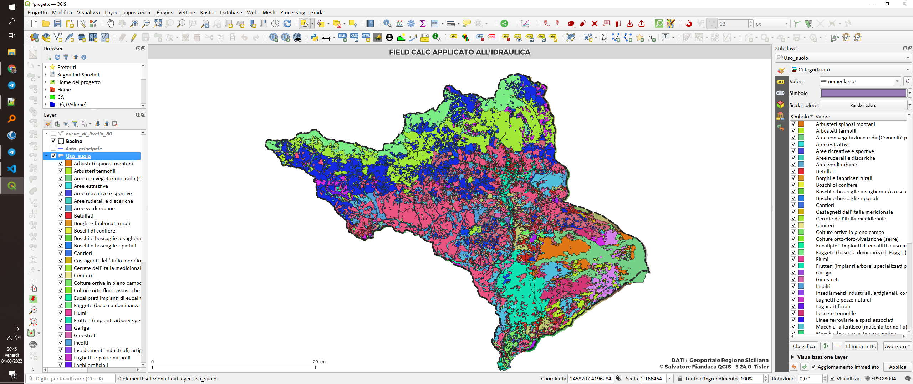
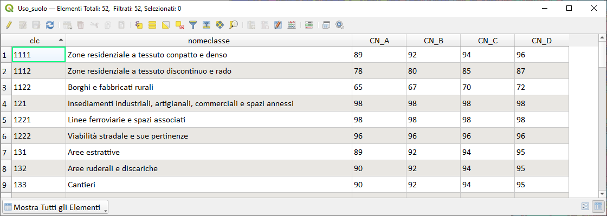
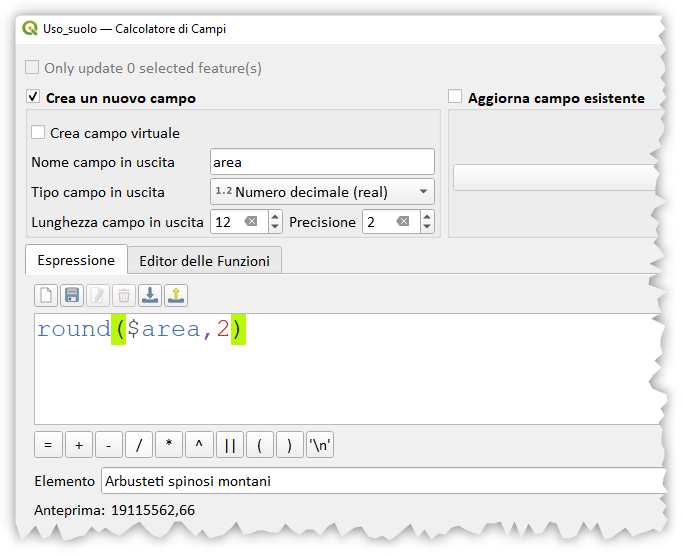
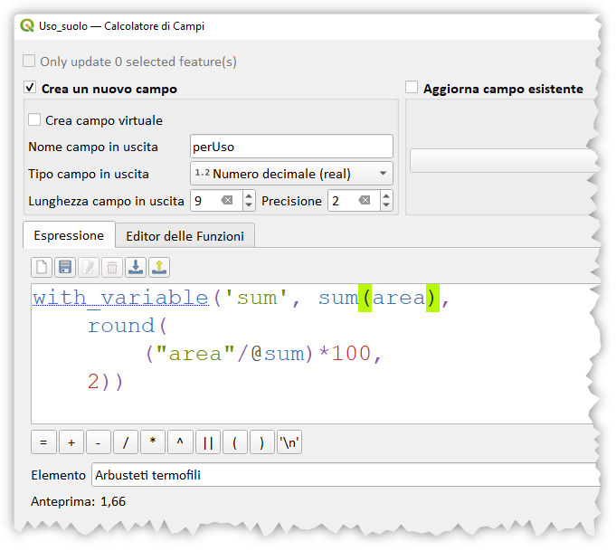
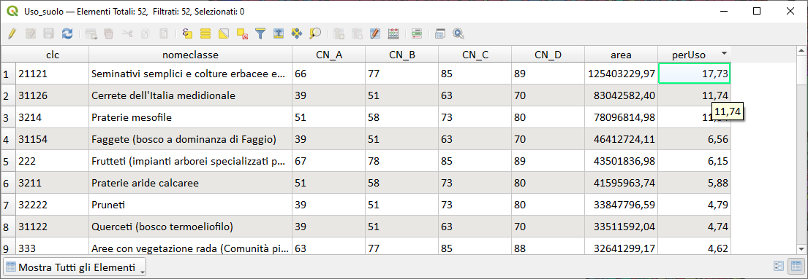
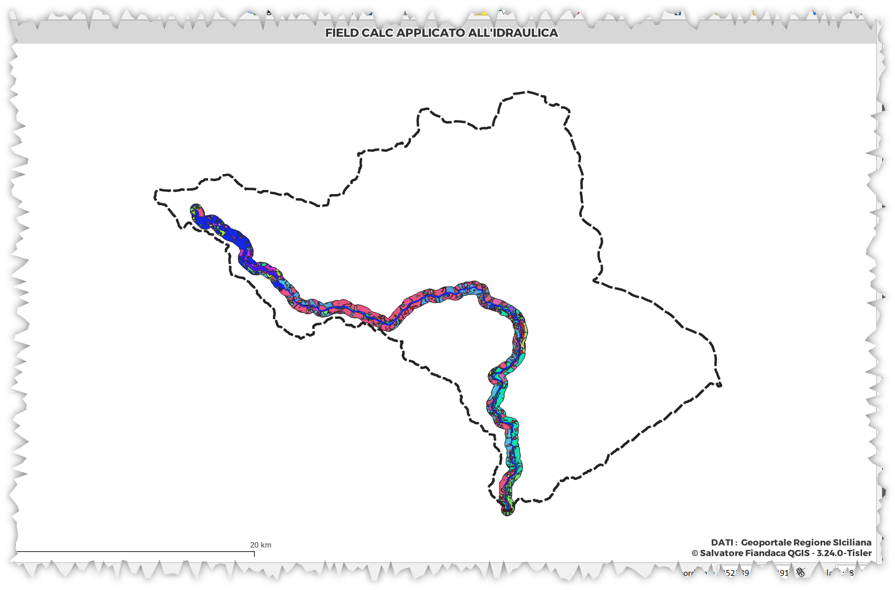

# Calcolo percentuali uso del suolo

## per bacino

Calcolare, per ogni classe, la percentuale di area di uso del suolo su un bacino. 



<!-- TOC -->

- [Calcolo percentuali uso del suolo](#calcolo-percentuali-uso-del-suolo)
  - [per bacino](#per-bacino)
    - [tabella degli attributi dell'uso del suolo](#tabella-degli-attributi-delluso-del-suolo)
    - [calcolo percentuale](#calcolo-percentuale)
      - [area](#area)
      - [percUso](#percuso)
  - [per Buffer su asta principale](#per-buffer-su-asta-principale)

<!-- /TOC -->

### tabella degli attributi dell'uso del suolo

L'uso del suolo è un layer poligonale (MultiPolygon) e ogni classe ha una sola riga nella tabella degli attributi:



↑[torna su](#calcolo-percentuali-uso-del-suolo-per-un-bacino)↑

### calcolo percentuale

Aggiungere un nuovo campo (area) alla tabella attributi, definirlo come Decimale e popolarlo con l'espressione:

#### area

```
round(
    $area,
2)
```



↑[torna su](#calcolo-percentuali-uso-del-suolo-per-un-bacino)↑

#### percUso

Aggiungere altro campo (perUso) e definirlo Decimale, popolarlo con l'espressione:

```
round(
    ("area"/sum("area"))*100,
2)
```

l'espressione di sopra non è ottimizzata, perché calcola molte volte `sum($area)` e questo fa perdere molto tempo, per ovviare, utilizzare l'espressione di sotto, che calcola una solva volta la sommatoria:

```
with_variable('sum', sum("area"),
    round(
        ("area"/@sum)*100,
    2))
```



tabella attributi finale:



↑[torna su](#calcolo-percentuali-uso-del-suolo-per-un-bacino)↑

## per Buffer su asta principale

1. Buffer da 500 m
2. intersezione Uso_suolo - Buffer
3. il calcolo percentuale è lo stesso di sopra adattato al solo buffer




