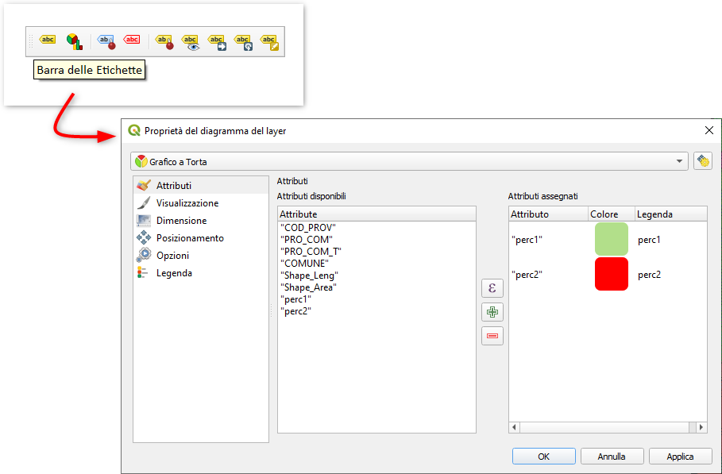
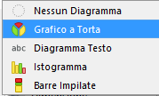
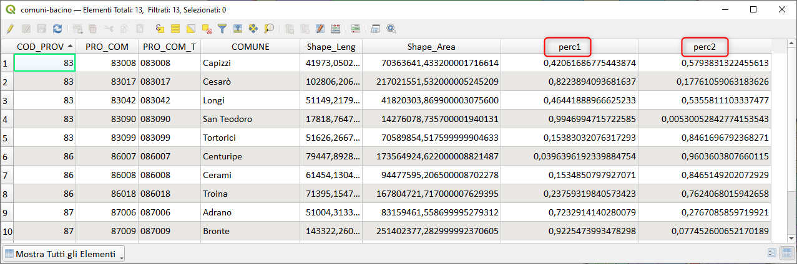
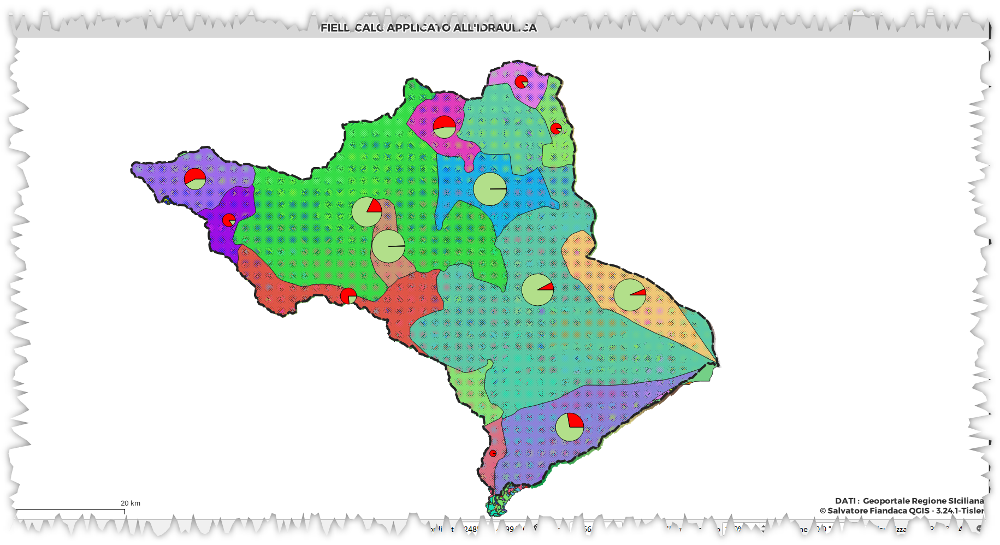

# Diagrammi

## Introduzione

**QGIS** permette di visualizzare dei diagrammi sovrapposti alle geometrie:

le tipologie presenti sono:

## Esempio proposto

Tracciare diagramma a torta che rappresenti la percentuale, sul totale, dell'area comunale ricadente nel bacino:

### espressioni utilizzate

1. campo `perc1` : `$area/"Shape_Area"`
2. campo `perc2` : `1 - $area/"Shape_Area"`

### risultato

## Osservazioni

Purtroppo i Diagrammi in QGIS sono stati da sempre poco sviluppati per mancanza di sponsor.
