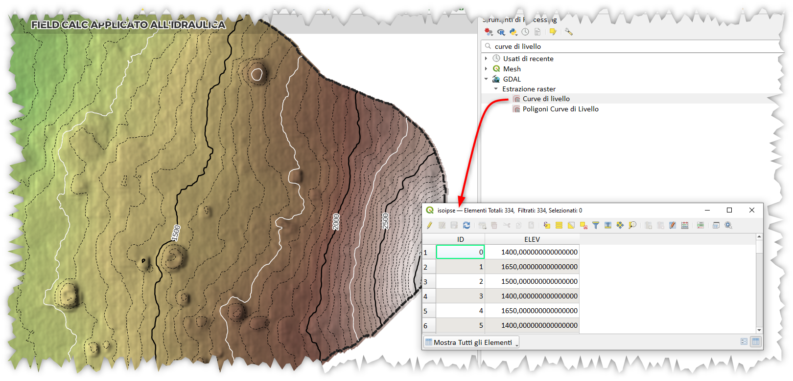
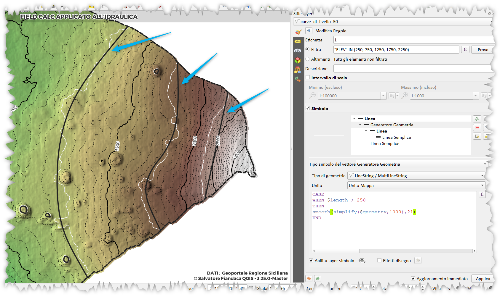

# Isoipse

Generare le curve di livello a partire da un DTM è ormai molto facile ed immadiato, QGIS/GDAL offre degli algoritmi pronti all'uso, sia per il calcolo delle isoipse 2D che 3D. 



## lunghezza

per il calcolo della lunghezza di sviluppo delle curve di livello basta utilizzare questa espressione:

```
round(
    length($geometry),
2)
```

## generalizzazione curve

Alcune volte le **isoipse** sono troppo frastagliate e nasce l'esigenza di 'ammorbidirle/lisciarle`, vediamo come farlo usando le espresioni di QGIS:

```
CASE
WHEN $length > 250
THEN 
    smooth(
        simplify($geometry,1000)
    ,21)
END
```



maggiori info: <https://hfcqgis.opendatasicilia.it/esempi/generalizzare_linee/>