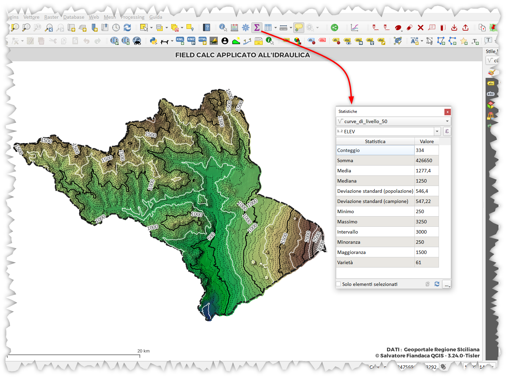
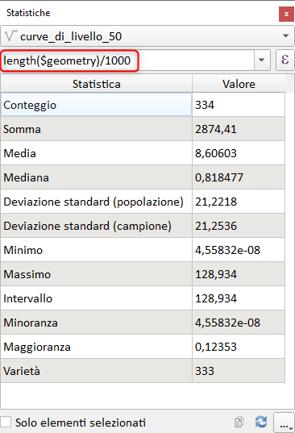

# Statistiche di sintesi

In QGIS è possibile calcolare le Statistiche di sintesi su layer vettoriali in cui è possibile utilizzare le espressioni:




## lunghezza

per il calcolo di statistiche sulla lunghezza delle isoipse in chilometri

```
length($geometry)/1000
```



Se volessi le statistiche solo per le isoipse chiuse:

```
if(
    is_closed($geometry),
    length($geometry)/1000,
    NULL)
```


