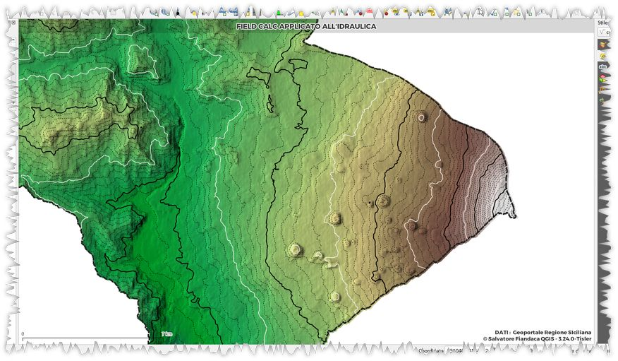
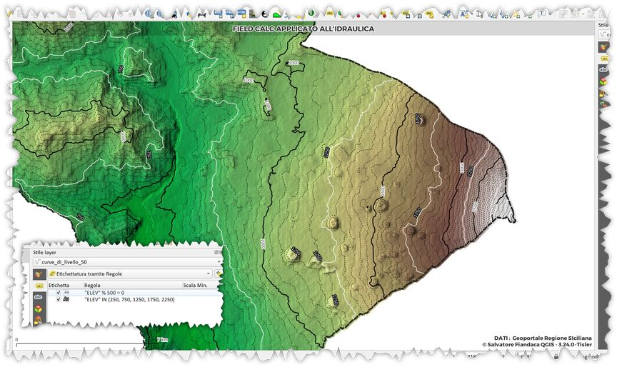

# Vestizione curve di livello

Come **tematizzare** e **etichettare** in modo particolare le curve di livello

<!-- TOC -->

- [Vestizione curve di livello](#vestizione-curve-di-livello)
  - [tematizzazione](#tematizzazione)
    - [stile layer](#stile-layer)
      - [Categorizzato](#categorizzato)
      - [tramite regole](#tramite-regole)
  - [etichettature](#etichettature)
    - [regole](#regole)
  - [etichettatura particolare](#etichettatura-particolare)

<!-- /TOC -->

## tematizzazione

Per una vestizione accattivante, le isoipse possono essere tematizzate in modo diverso a seconda del valore di quota, ecco un esempio:


### stile layer

#### Categorizzato

usando la seguente espressione:

```
"ELEV" % 500 = 0
```
dove `ELEV` è l'attributo che contiene i valori di elevazione/quota; l'espressione è vera (1) solo quando la divisione ELEV/500 non ha resto. 


#### tramite regole

nel caso volessimo più valori diversificati, usare le Regole:


ottenendo



## etichettature

### regole

Per far seguire l'etichettatura alla tematizzazione particolare fatta prima:


oppure:



## etichettatura particolare

Etichettare lungo una line

<video width="320" height="240" controls>
    <source src="./imgs/esempi/label_line.mp4" type="video/mp4">
</video>

espressione utilizzata:

```
intersection( 
$geometry, buffer(geometry(get_feature_by_id('linea', 1)),20))
```

blog post riferimento: <https://pigrecoinfinito.com/2020/01/31/qgis-come-allineare-le-etichette-delle-isoipse/>
